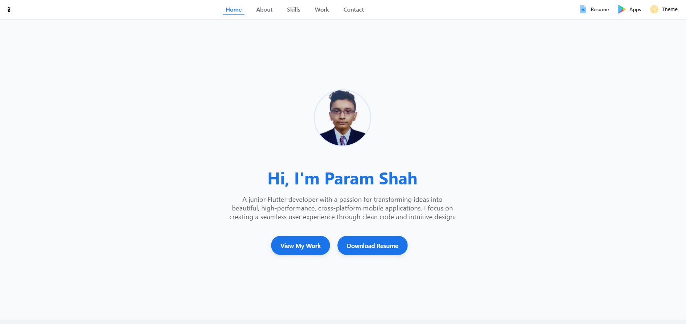

# 🌐 Project Overview

This repository hosts my **personal portfolio**:

- 🌇 **[`index.html`](https://pdshah09.github.io/portfolio/)** – Modern, Material Design-inspired UI with animations, dark mode toggle, and interactive elements.

All versions are **fully responsive**, minimalist, and built with **clean, semantic HTML and CSS**.  
The TUI version is completely **JavaScript-free**, while the modern version uses **vanilla JS** to enhance user experience.

---

## 📸 Screenshots

### 🌇 Material UI [▶](https://pdshah09.github.io/portfolio/) 

---

## ✨ Key Features

### 🌇 Modern UI (`index.html`)

This version focuses on a clean, modern user experience with smooth interactions and a professional aesthetic.

#### **UI & Visual Design**
- **Layout:** Material Design-inspired, card-based layout that is spacious and clean.
- **Responsiveness:** Fully responsive design with:
  - **Mobile:** Bottom navigation bar.
  - **Desktop:** Top app bar.
- **Dynamic Theming:** A **JavaScript-powered light/dark mode toggle**.
- **Custom Theming:** Toggle buttons for applying **custom themes**.   
  The user's choice is stored in `localStorage` for a **persistent experience**.

#### **UX & Interactivity**
- **Immersive Navigation:**  
  - Navigation bars **auto-hide on scroll down** and **reappear on scroll up**.  
    Implemented with a **debounced scroll listener** in vanilla JS for performance.
- **Active Section Highlighting:**  
  - Uses the **IntersectionObserver API** to efficiently detect the current section in view and update active states.
- **Rich Micro-interactions:**  
  - **Animated Skill Badges:** Subtle CSS-animated underline on hover.
  - **Gradient Hover Effects:** Profile picture and header icons have **rotating conic-gradient borders** on hover.

---

## 🔧 Technologies Used

| Technology   | Usage                                                                 |
|-------------|------------------------------------------------------------------------|
| **HTML5**   | Structure & semantics                                                 |
| **CSS3**    | Layouts, animations, variables, responsive design, JS-free interactivity |
| **JavaScript** | Only in `index.html` for theme toggle, scroll detection & active links |
